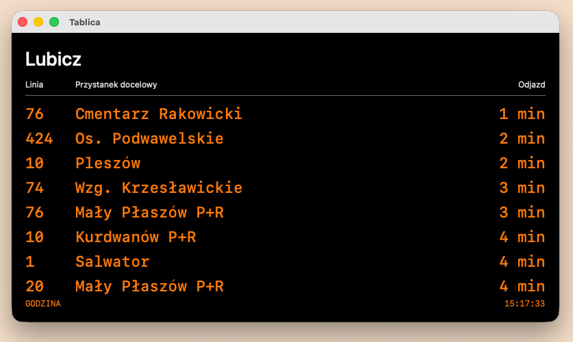
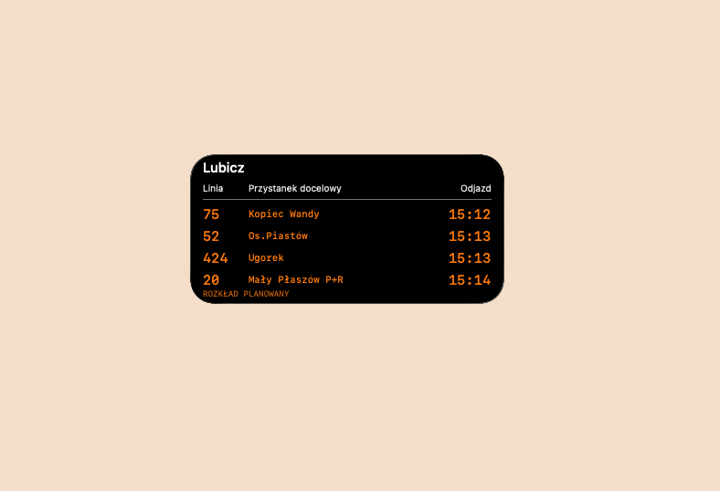
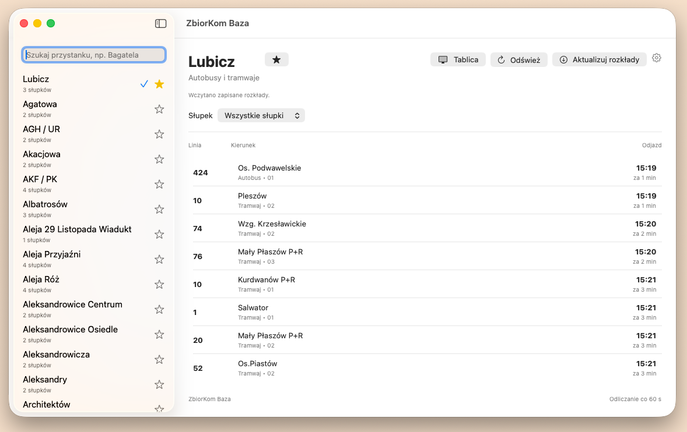

# ZbiorKom Baza

ZbiorKom Baza to niezależna aplikacja na macOS do wygodnego sprawdzania odjazdów komunikacji miejskiej w Krakowie. Łączy rozkłady autobusów i tramwajów w jedną tablicę, dzięki czemu nie trzeba przełączać się między różnymi środkami transportu.

## Funkcje

- Wyszukiwanie przystanków po nazwie, także bez polskich znaków.
- Wspólna tablica odjazdów autobusów i tramwajów.
- Wybór konkretnego słupka, np. 01 lub 02.
- Zapisywanie ulubionych przystanków.
- Widżet macOS z własnym przystankiem i słupkiem wybranym spośród ulubionych.
- Dwa style widżetu: standardowy oraz inspirowany krakowskimi tablicami przystankowymi.
- Lokalne przechowywanie rozkładów i ustawień.

## Design

Poszczególne funkcjonalności aplikacji stylizowane są na wzór spotykanych w Krakowie wyświetlaczy rozkładu jazdy na przystankach

## Dane

Aplikacja korzysta z publicznie udostępnianych danych GTFS Zarządu Transportu Publicznego w Krakowie. Obecnie prezentuje odjazdy planowane, a nie rzeczywiste opóźnienia.

ZbiorKom Baza jest projektem niezależnym i nie jest oficjalną aplikacją ZTP ani MPK Kraków.

## Technologie

Swift, SwiftUI, WidgetKit, GTFS, ZIPFoundation.

## Status

Projekt jest w trakcie rozwoju. Planowane są dalsze usprawnienia widżetu oraz obsługa danych realtime.

## Zrzuty ekranu

## Wybierajcie ZbiorKom <3
